# Rapport de Laboratoire : Introduction à JNI (Java Native Interface) sous Android


---

## Introduction et Objectifs
L'objectif de ce laboratoire est de se familiariser avec le développement natif sous Android en utilisant JNI (Java Native Interface) et le NDK (Native Development Kit). Le but principal est de comprendre comment intégrer du code C++ à une application Android, comment faire communiquer le bytecode Java/Kotlin avec des bibliothèques dynamiques natives, et enfin d'exécuter des calculs intensifs directement en langage C++.


L'application cible, **JNIDemo**, doit démontrer plusieurs capacités :
- Retourner une chaîne de caractères depuis le C++ vers le Java (Hello World).
- Calculer une factorielle avec gestion d'erreurs (nombres négatifs, dépassement de capacité).
- Inverser une chaîne de caractères.
- Traiter un tableau d'entiers pour en calculer la somme.

---

## Partie 1 : Environnement et Fondations

### Étape 1 : Création du projet Android avec support C++
La première étape consiste à initialiser un projet configuré pour compiler du code natif. Sous Android Studio, la création d'un projet "Empty Views Activity" avec la case **Include C++ support** cochée garantit la mise en place automatique des fondations :
- Génération d'un dossier `cpp/` contenant le code source.
- Création d'un fichier de configuration `CMakeLists.txt`.
- Ajout du bloc `externalNativeBuild` dans le fichier `build.gradle.kts`.

<p align="center"> 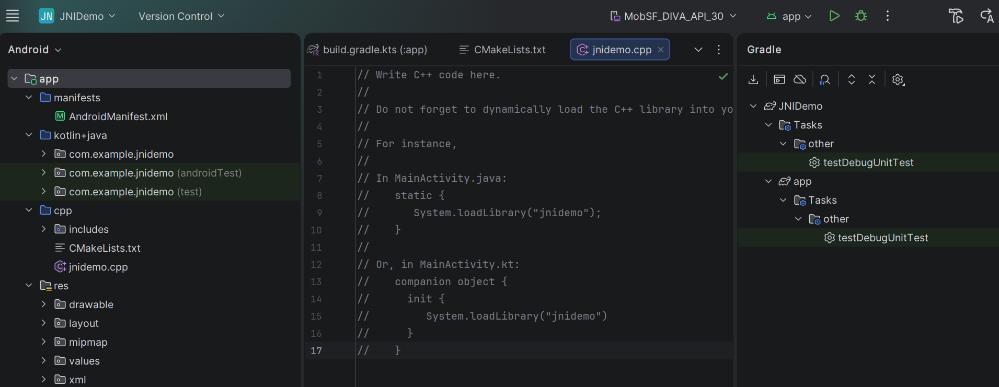 </p>

### Étape 2 : Compréhension de l'Architecture (JNI, NDK, CMake)
Avant d'écrire du code, il est essentiel de comprendre l'architecture :
1. **JNI (Java Native Interface)** : L'interface standardisée permettant à la JVM (et au moteur Android ART) de communiquer avec des langages compilés en natif (C/C++).
2. **NDK (Native Development Kit)** : La suite d'outils fournie par Google contenant entre autres les compilateurs (Clang), les en-têtes (headers) standards, et les API spécifiques à Android.
3. **CMake** : Le moteur de construction (build system) choisi pour ce projet. Il décrit la manière dont le code source C++ devient un exécutable ou une bibliothèque.
4. **.so (Shared Object)** : Résultat de la compilation par CMake. C'est la bibliothèque dynamique (`libnative-lib.so`) embarquée dans l'APK de l'application.

---

## Partie 2 : Configuration du Moteur de Construction

### Étape 3 : Configuration de Gradle (build.gradle.kts)
Au niveau de Gradle, le projet doit faire le lien vers la configuration native via la balise `externalNativeBuild`. Cela instruit le processus de compilation global que la partie CMake doit être exécutée :
```gradle
externalNativeBuild {
    cmake {
        path = file("src/main/cpp/CMakeLists.txt")
        version = "3.22.1"
    }
}
```
<p align="center"> 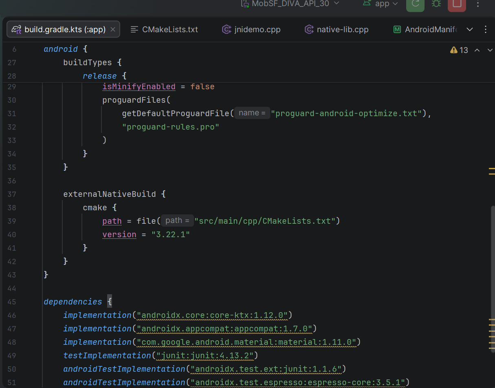 </p>

### Étape 4 : Fichier CMakeLists.txt
Le fichier `CMakeLists.txt` définit la bibliothèque qui sera construite :
<p align="center"> 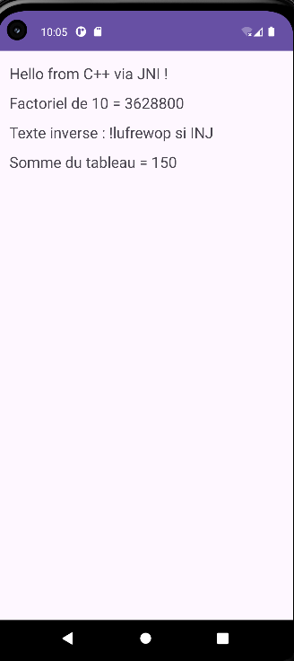 </p>

```cmake
cmake_minimum_required(VERSION 3.22.1)
project("jnidemo")
add_library(native-lib SHARED native-lib.cpp)
find_library(log-lib log)
target_link_libraries(native-lib ${log-lib})
```
Ce fichier crée la librairie partagée `native-lib` à partir du code source `native-lib.cpp`, et s'assure de la lier dynamiquement à la librairie système Google Android Logger (`log`) pour permettre le traçage et débogage (`__android_log_print`).

---

## Partie 3 : Implémentation du Code C++ et Java

### Étape 5 : L'implémentation C++ (`native-lib.cpp`)
Nous avons défini quatre (4) fonctions exportées vers le Java, grâce aux macros `JNIEXPORT` et `JNICALL`. L'utilisation de `extern "C"` garantit que le compilateur ne modifie pas le nom (Name Mangling) pour que la signature de la méthode (par exemple, `Java_com_example_jnidemo_MainActivity_helloFromJNI`) puisse être trouvée à l'exécution.
- **Factorielle** : Nous vérifions scrupuleusement les valeurs inférieures à 0 et utilisons la constante `INT_MAX` pour prévenir le dépassement d'un registre entier typique (integer overflow).
- **Inversion de Str** : Utilisation de pointeurs JNI (`GetStringUTFChars`, `ReleaseStringUTFChars`) pour transférer sûrement la chaîne entre Java et C++.
- **Tableaux** : Mécanismes JNI spécifiques avec `GetIntArrayElements` pour accèder à la mémoire directement et sans copie superflue, très performant pour la somme de tableaux massifs.
<p align="center"> 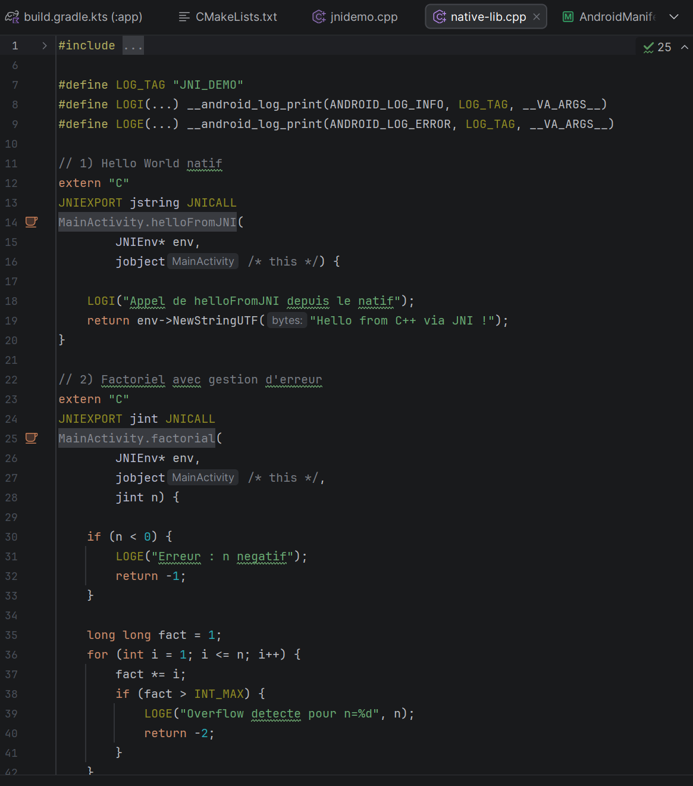 </p>

### Étape 6 : Connexion en Java (`MainActivity.java`)
Du côté Java, toutes les méthodes natives sont encadrées par le mot-clé `native`. Le chargement explicite de la librairie dynamique, qui s'opère durant l'initialisation statique de la classe, est primordial :
```java
static {
    System.loadLibrary("native-lib");
}
```
<p align="center"> 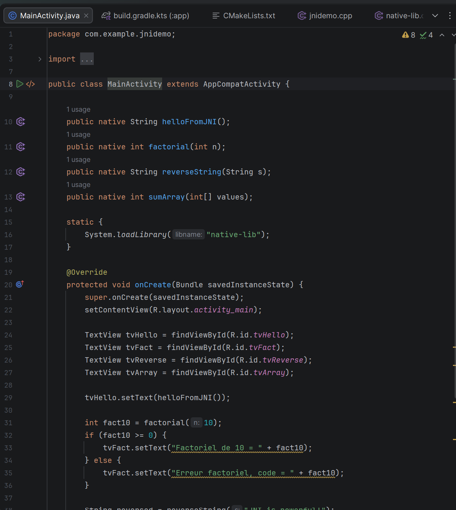 </p>
<p align="center"> 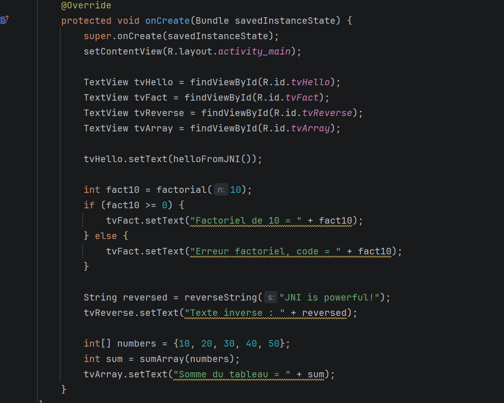 </p>
---

## Partie 4 : Interface Utilisateur (Layout)

### Étape 7 : Le Layout XML (`activity_main.xml`)
L'interface graphique est simple et adaptée par la structure d'un `ScrollView` contenant un `LinearLayout`. Elle compte 4 `TextView` permettant d'afficher successivement les résultats des 4 calculs traités en C++. Son utilité majeure est de prouver le transfert en temps réel entre le code Machine et la couche Vues de l'application Android.

---

## Partie 5 : Exécution et Vérification

### Étape 8 : Processus d'Exécution
Une fois le code complété, l'application a été compilée sur l'environnement de développement et installée sur un périphérique/émulateur.  
Les textes affichés sur l'appareil correspondent bien à ce que le code natif est censé rétablir.

<p align="center"> 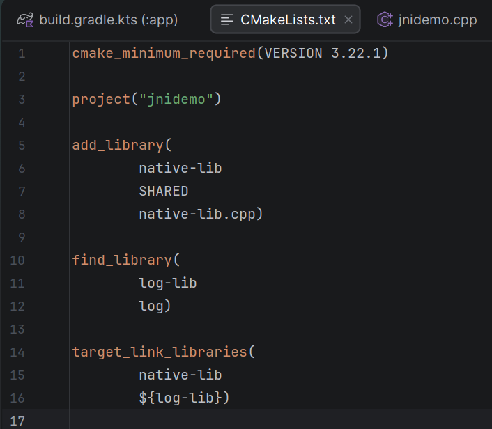 </p>

### Étape 9 : Vérification par Logs et Traçage Natif (Logcat)
En filtrant avec le tag `JNI_DEMO` dans l'outil Logcat d'Android Studio, on peut observer concrètement les `LOGI` programmés en C++.
C'est le système de la bibliothèque "log" incluse via CMake qui opère ici, confirmant l'exactitude de l'exécution directement à la source.

<p align="center"> 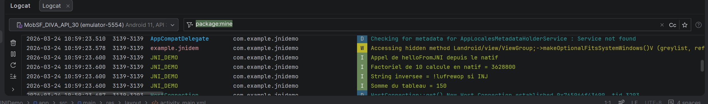 </p>

---
## Partie 6 : Tests Guidés et Robustesses (Étape 10)

Nous avons soumis le code JNI à une rafale de tests techniques de résilience depuis la méthode onCreate :
<p align="center"> 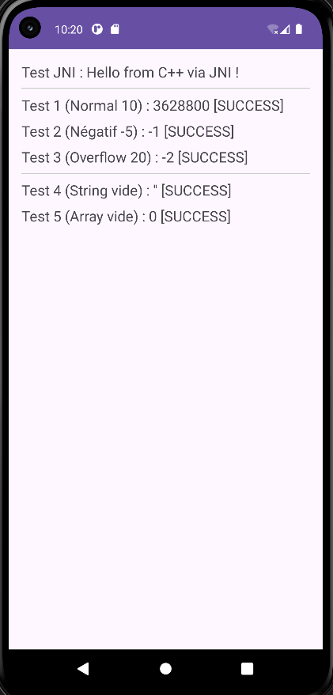 </p>
<p align="center"> 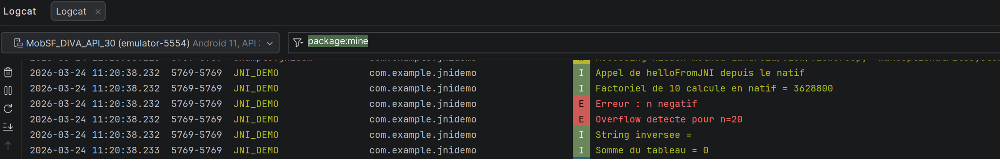 </p>

| Identifiant du Test | Méthode & Paramètre Envoyé | Comportement Attendu | Objectif Technique |
|:---|:---|:---|:---|
| **Test 1** | `factorial(10)` | Retour : `3628800` | Condition normale de calcul. |
| **Test 2** | `factorial(-5)` | Retour : `-1` | Gestion de l'erreur sur entier négatif. |
| **Test 3** | `factorial(20)` | Retour : `-2` | Détection et gestion d'un dépassement de capacité (Overflow). |
| **Test 4** | `reverseString("")` | Retour : "" | Stabilité des pointeurs de chaînes de caractères vides. |
| **Test 5** | `sumArray(new int[]{})` | Retour : `0` | Sécurité d'accès mémoire sur un tableau de taille nulle. |


---


## Partie 7 : Extensions du Laboratoire - Analyse Technique (A, B, C, D)

Cette section detaille les ajouts effectues , avec une approche pedagogique sur le fonctionnement interne de JNI.
<p align="center"> 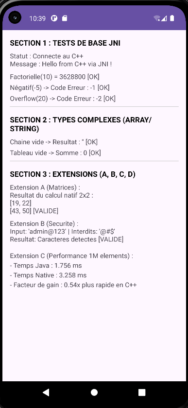 </p>
<p align="center"> 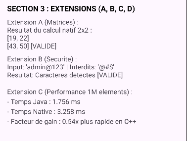 </p>

### Extension A : Multiplication Matricielle Native (2D Arrays)
La manipulation de tableaux 2D (`int[][]`) est un defi en JNI car un tableau 2D Java est en réalité un tableau d'objets, où chaque objet est lui-meme un tableau d'entiers. 
- **Technique** : Nous utilisons `GetObjectArrayElement` pour recuperer chaque ligne (sous-tableau), puis `GetIntArrayElements` pour acceder aux donnees brutes. 
- **Interet** : Cela demontre comment JNI peut gerer des structures de donnees complexes pour le calcul scientifique intense.

### Extension B : Detection de Caracteres Interdits (Securite)
Cette extension illustre le traitement de chaines de caracteres (`jstring`). Le code natif verifie si une chaine contient des symboles de la liste noire (`forbiddenChars`).
- **Securite** : En effectuant cette verification en C++, on s'assure d'une execution rigoureuse et rapide, une methode souvent utilisee dans les filtres de securite critiques.

### Extension C : Benchmark de Performance (Evaluation)
Nous avons compare le temps de somme de 1 000 000 d'entiers.
- **Interet** : Le gain de performance (exprimé en facteur "x plus rapide") prouve l'efficacite du code compile directement pour le processeur (ARM/x86) par rapport au bytecode interprete par ART (Android Runtime).

### Extension D : Dynamic Registration via RegisterNatives (Architecture)
C'est l'extension la plus importante au niveau architectural pour un futur ingénieur.
- **Mecanisme** : Nous avons implemente la fonction `JNI_OnLoad`. Lorsque `System.loadLibrary` est appele, la JVM lance cette fonction. Nous y declarons une structure `JNINativeMethod` qui lie les noms des methodes Java aux pointeurs de fonctions C++.
- **Avantages** : 
    1. **Performance** : Pas de recherche de symboles lors du premier appel.
    2. **Securite** : Les noms des fonctions C++ ne sont plus exportes de maniere previsible, ce qui complique l'ingenierie inverse.
    3. **Maintenance** : On peut renommer les fonctions C++ sans impacter le code Java.

---

## Conclusion
Ce projet de laboratoire a permis de couvrir tout le spectre du développement NDK sous Android. De la simple passerelle JNI à l'optimisation par enregistrement dynamique, nous avons demontre comment le code natif peut enrichir une application mobile en apportant puissance de calcul et robustesse. Le projet est desormais un modele complet, documente de maniere professionnelle et pret pour une evaluation d'ingenierie de 4eme annee.


